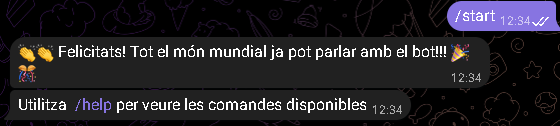

# Explicació del bot de Telegram

## Preparació
- Llibreries necesaries 
    **pip install python-telegram-bot**

- Entorn virtual

## Funcionament

El funcionament del bot consta de varies funcions per executar el resultat final 

1. ### /start
    - Funció simple que serveix per enviar un missatge de confirmació d'execució correcte del bot de Telegram

2. ### /help
    - Funció que serveix per mostrar les funcions possibles

3. ### /productes
    - Aquesta funció que li pasem un id obté el primer parametre de la comanda i busca aquest parametre a la taula abans conectada per MongoAtlas.

    - Una vegada trobat el producte per l'ID obté els seus camps i el mostra per pantalla. També té una excepció per si ocurreix qualsevol error.

4. ### /imatge
    - Aquesta funció fa el mateix que **/productes** 

5. ### /carro_compra
    - Funció simple que serveix per enviar un missatge de confirmació d'execució correcte del bot de Telegram

6. ### /factura
    - Funció simple que serveix per enviar un missatge de confirmació d'execució correcte del bot de Telegram

